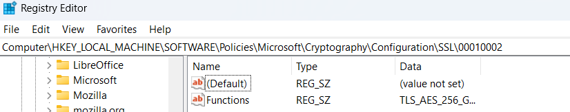

# DB
This repo contains the DB topics

## Connect windows 11 to sql server 2000
I found a good solution in https://stackoverflow.com/questions/74531774/connect-windows-11-to-sql-server-2000.
In summuray, Windows 11 has updated the encyption mechanishm to make it more robust. However, several old applications such as SQL Server 2000 can not support this new encryption method. One of the solution is to allow Windows 11 use previous encryption method as written in above link.

Steps:
1. Add parameter using regedit HKEY_LOCAL_MACHINE\SOFTWARE\Policies\Microsoft\Cryptography\Configuration\SSL\00010002
2. Add Function

 or

 1. Download the 2024-05-17 Windows 11 enable older SSL cyphers.reg
 2. open CMD as Administrator
 3. run 2024-05-17 Windows 11 enable older SSL cyphers.reg

